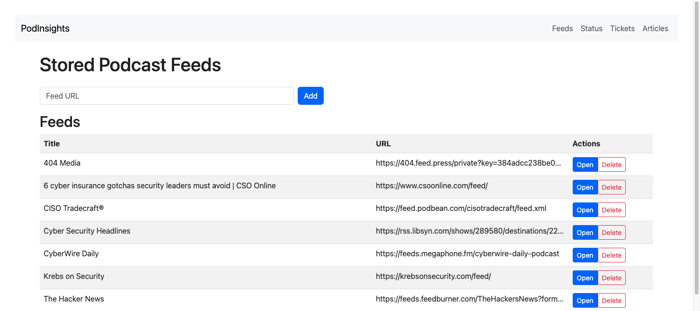
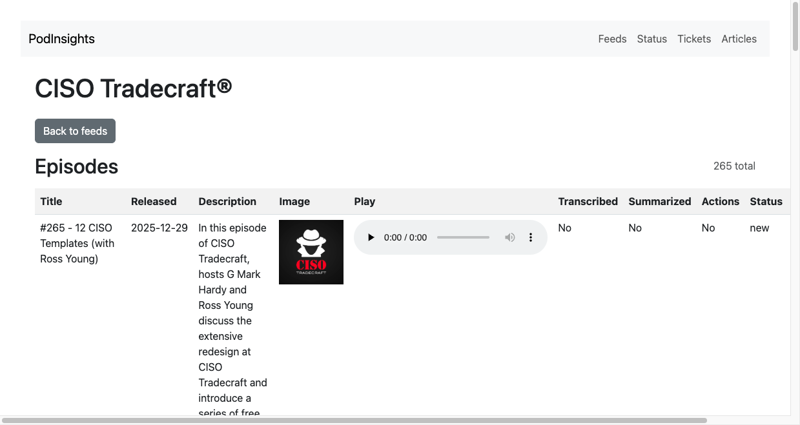
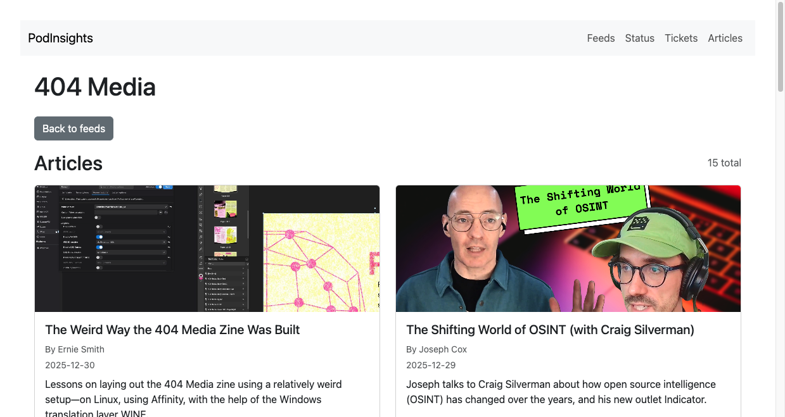
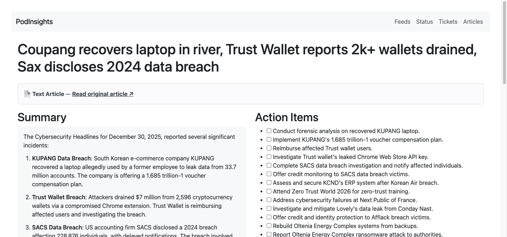
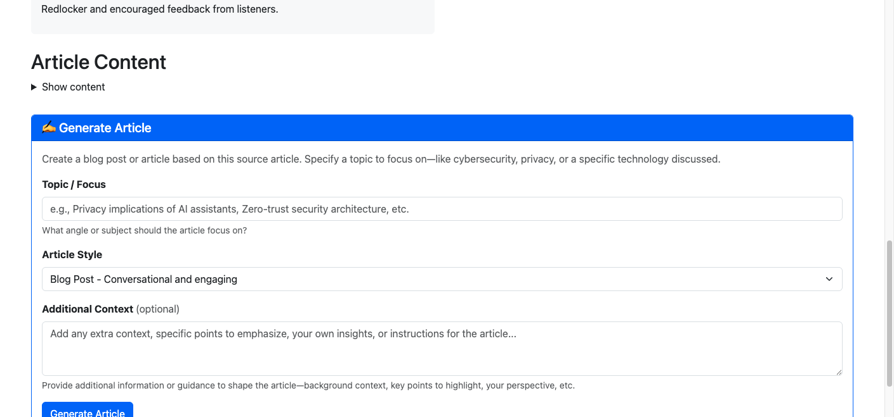
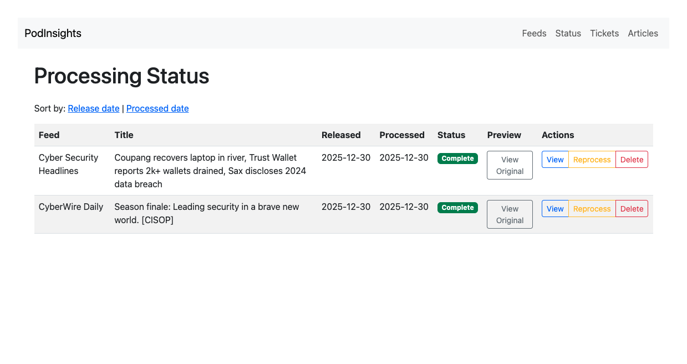
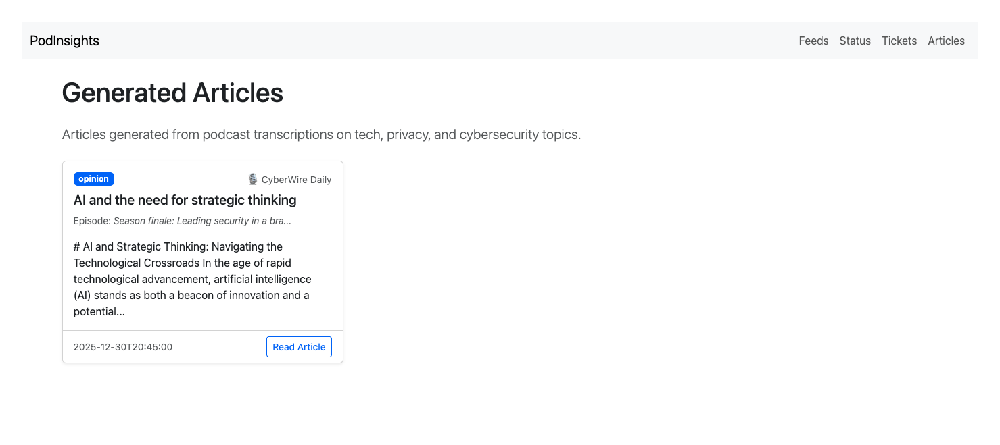

**PodInsights: AI-Powered Podcast Transcription, Summarization & Action Item Extraction Tool**

PodInsights is the ultimate podcast analysis tool for creators, researchers, and business professionals who need to extract valuable insights from audio content. Our tool combines state-of-the-art speech recognition with powerful AI summarization to transform hours of podcast content into actionable intelligence.

### Key Features

- **Accurate Podcast Transcription** - Convert any podcast episode into searchable text with industry-leading accuracy
- **Intelligent Summarization** - Automatically generate concise summaries capturing the core message of any episode
- **Action Item Extraction** - Never miss important tasks or follow-ups mentioned in podcast discussions
- **Article Generation** - Transform podcast content into polished blog posts and articles on tech, privacy, and cybersecurity topics
- **Social Media Content** - Auto-generate platform-optimized social media posts from your articles
- **LinkedIn Integration** - Post articles and social content directly to LinkedIn with rich link previews
- **Post Scheduling** - Queue posts with configurable time slots for automated publishing
- **JIRA Integration** - Seamlessly create tickets from extracted action items for project management
- **RSS Feed Support** - Process entire podcast feeds directly from their source

### Use Cases

- Content creators tracking competitive analysis from industry podcasts
- Researchers analyzing interview content for qualitative research
- Business professionals extracting action items from recorded meetings
- Podcast fans who want to quickly understand episode content before listening
- Knowledge workers converting audio information into structured text data
- Marketing teams scheduling social media content from podcast insights

*PodInsights - Transforming podcast content into actionable intelligence.*

## Screenshots

### Feeds Page
Manage your podcast and text RSS feeds from a central dashboard. Add new feeds, open existing ones, or delete feeds you no longer need.



### Podcast Feed View
Browse episodes from audio podcast feeds with release dates, descriptions, and built-in audio players.



### Text Feed View
Browse articles from text-based RSS feeds (like news sites and blogs) with thumbnail images and article previews.



### Episode Results
View AI-generated summaries and extracted action items from processed episodes. The summary renders markdown formatting for easy reading.



### Generate Article
Transform podcast insights into polished blog posts and articles. Choose your topic, style, and add optional context.



### Processing Status
Track all processed episodes across feeds. Reprocess or delete episodes as needed.



### Articles Page
Access all generated articles in one place.



### JIRA Tickets
View and manage JIRA tickets created from action items.


---

PodInsights is a simple command-line tool that helps you transcribe podcast audio files and extract useful information from them. The current implementation relies on the [`faster-whisper`](https://github.com/guillaumekln/faster-whisper) library for transcription. Summarization and action item extraction are performed exclusively using OpenAI's chat models.

## Requirements

- Python 3.11+
- [`faster-whisper`](https://github.com/guillaumekln/faster-whisper) installed for audio transcription
- [`openai`](https://pypi.org/project/openai/) and a valid `OPENAI_API_KEY` environment variable
- For the web interface: [`Flask`](https://palletsprojects.com/p/flask/), [`feedparser`](https://pypi.org/project/feedparser/), and [`requests`](https://pypi.org/project/requests/)
  (`sqlite3` from the standard library is used for episode tracking)

## Installation

### Setting Up a Virtual Environment

1. **Create a virtual environment:**

   ```bash
   python3 -m venv venv
   ```

2. **Activate the virtual environment:**

   - On macOS/Linux:
     ```bash
     source venv/bin/activate
     ```

   - On Windows:
     ```bash
     venv\Scripts\activate
     ```

3. **Install dependencies:**

   ```bash
   pip install -r requirements.txt
   ```

   For audio transcription, also install `faster-whisper`:
   ```bash
   pip install faster-whisper
   ```
   > Note: `faster-whisper` may have platform-specific requirements. See [faster-whisper docs](https://github.com/guillaumekln/faster-whisper) for details.

4. **Set up environment variables:**

   ```bash
   export OPENAI_API_KEY="your-api-key-here"
   ```

   For JIRA integration (optional):
   ```bash
   export JIRA_BASE_URL="https://example.atlassian.net"
   export JIRA_EMAIL="your-email@example.com"
   export JIRA_API_TOKEN="your-jira-token"
   export JIRA_PROJECT_KEY="PROJ"
   ```

5. **Run the application:**

   - CLI:
     ```bash
     python podinsights.py path/to/podcast.mp3
     ```

   - Web UI:
     ```bash
     python podinsights_web.py
     ```

## Environment Variables

The following environment variables control authentication, model selection, and integration features:

### Required for All Modes

- **`OPENAI_API_KEY`** *(required)*: Your OpenAI API key. Required for all summarization and action item extraction features.

### Optional (Advanced Usage)

- **`OPENAI_MODEL`**: The OpenAI model to use for summarization, action item extraction, and article generation (default: `gpt-4o`). Set this if you want to use a different model.

### Required for JIRA Integration (Web UI)

- **`JIRA_BASE_URL`**: The base URL of your JIRA Cloud instance (e.g., `https://example.atlassian.net`).
- **`JIRA_EMAIL`**: The email address associated with your JIRA API token.
- **`JIRA_API_TOKEN`**: Your JIRA API token.
- **`JIRA_PROJECT_KEY`**: The project key where new issues should be created.

### Required for LinkedIn Integration (Web UI)

- **`LINKEDIN_CLIENT_ID`**: Your LinkedIn app's Client ID from the [LinkedIn Developer Portal](https://www.linkedin.com/developers/).
- **`LINKEDIN_CLIENT_SECRET`**: Your LinkedIn app's Client Secret.
- **`LINKEDIN_REDIRECT_URI`**: The OAuth callback URL (default: `http://localhost:5001/linkedin/callback`). Must match the redirect URI configured in your LinkedIn app.

### Optional for Web UI

- **`PORT`**: The port for the Flask web server (default: `5001`). Set this if you want the web UI to run on a different port.
- **`LINKEDIN_SCOPES`**: OAuth scopes for LinkedIn (default: `openid profile w_member_social`). Only change if you have specific scope requirements.

## Usage (CLI)

```bash
python podinsights.py path/to/podcast.mp3
```

The script will attempt to transcribe the audio file using `faster-whisper`, then ask OpenAI to produce a short summary and extract action items. Results are also written to a JSON file next to the audio by default. You can specify a custom output path with the `--json` option. Use `--verbose` to enable debug logging.
Progress messages are printed to the terminal so you can follow each step of the process.

> **Note**: If the `faster-whisper` package is not installed, the script will raise a `NotImplementedError`. Install all dependencies via `pip install -r requirements.txt`.
> **Note**: Summarization and action item extraction require OpenAI access. Ensure `OPENAI_API_KEY` is set in your environment.

The JSON file contains three fields:

- `transcript` – the full transcript of the audio
- `summary` – the generated summary text
- `action_items` – a list of extracted action items

## Usage (Web UI)

A lightweight Flask application is provided in `podinsights_web.py`. It allows you to enter a podcast RSS feed URL, list the available episodes, and process an episode directly from your browser. Make sure you've installed dependencies from `requirements.txt`, then run:

```bash
python podinsights_web.py
```

Navigate to `http://localhost:5001` and add an RSS feed URL. Stored feeds are listed on the home page so you can return to them later. Selecting a feed shows the episodes along with their processing status.
When you process an episode a small overlay indicates progress until the results are displayed.
The episode description is shown at the top of the results page so you have context when reviewing the summary and action items. The full transcript is also available on the page in a collapsible section for reference.

Episode descriptions and any images provided by the feed are displayed next to each title to help you identify episodes before processing.

You can listen to any episode directly from the browser. Each episode row now includes a small audio player so you can preview the content before processing or reviewing tickets.

Processed episodes are stored in a local SQLite database (`episodes.db`). Each episode records the transcript, summary, and action items. The feed view reports whether these pieces of information have been extracted.


### Generating Articles

Transform podcast insights into polished articles for your blog or publication. After processing an episode, use the **Generate Article** section to create content focused on specific topics like cybersecurity, privacy, or emerging technology trends.

1. Process a podcast episode to get the transcript and summary
2. Scroll to the "Generate Article" section
3. Enter a topic or angle (e.g., "Privacy implications of AI voice assistants")
4. Select an article style:
   - **Blog Post** - Conversational and engaging
   - **News Article** - Factual and objective reporting
   - **Opinion/Editorial** - Analysis with perspective
   - **Technical Deep-Dive** - Detailed for practitioners
5. Click **Generate Article**

All generated articles are saved and can be accessed from the **Articles** page in the navigation.

### Creating JIRA Tickets

You can create JIRA issues directly from the action items listed on the result
page. Set the following environment variables so the web app can access your
JIRA Cloud instance:

- `JIRA_BASE_URL` – e.g. `https://example.atlassian.net`
- `JIRA_EMAIL` – the email associated with an API token
- `JIRA_API_TOKEN` – your JIRA API token
- `JIRA_PROJECT_KEY` – project key for new issues

Select the action items you want to track and click **Create JIRA Tickets**.
Created issues are stored locally so you can access them later. When viewing an
episode's results the associated JIRA tickets are listed with links. A dedicated
"Tickets" page in the web interface lists every issue that has been created.

Each created ticket includes context about where the action item came from. The
description notes the podcast episode title and includes the generated summary
so your team has immediate background when reviewing the issue.

Ticket status is fetched directly from JIRA whenever you view the tickets page
or the list of tickets on an episode's results page, so you can quickly see
whether items are still open or have been resolved.

The web interface also provides a **Status** page listing all queued and processed episodes from every feed. Use the **Queue** link next to an episode to process it in the background and track its progress on the Status page.

### Posting to LinkedIn

Share your generated articles and social media content directly to LinkedIn with rich link previews. The integration supports both immediate posting and scheduled publishing.

#### Setting Up LinkedIn Integration

1. **Create a LinkedIn App** at the [LinkedIn Developer Portal](https://www.linkedin.com/developers/apps)
2. **Add the required products** to your app:
   - "Share on LinkedIn" - enables posting (provides `w_member_social` scope)
   - "Sign In with LinkedIn using OpenID Connect" - enables user identification (provides `openid`, `profile` scopes)
3. **Configure the OAuth redirect URL** in your app settings:
   - Add `http://localhost:5001/linkedin/callback` (or your custom domain)
4. **Set environment variables**:
   ```bash
   export LINKEDIN_CLIENT_ID="your-client-id"
   export LINKEDIN_CLIENT_SECRET="your-client-secret"
   export LINKEDIN_REDIRECT_URI="http://localhost:5001/linkedin/callback"
   ```
5. **Connect your account** by clicking "Connect LinkedIn" on any article page

#### Posting Content

From any article page, you can:
- **Post Social Media Copy** - Click "Post to LinkedIn" next to any generated social post
- **Post Article** - Share the full article with a custom introduction
- **Add to Queue** - Click the ➕ button to schedule a post for the next available time slot

Posts containing URLs automatically include rich link previews with:
- Title extracted from the linked page's Open Graph metadata
- Description from the page
- Thumbnail image uploaded to LinkedIn

#### Scheduling Posts

Use the **Schedule** page to manage your posting queue and configure automated publishing:

1. **Configure Time Slots** - Set up recurring posting times:
   - Add daily slots (e.g., "Post every day at 9:00 AM")
   - Add day-specific slots (e.g., "Post on Mondays at 2:00 PM")
   - Enable/disable slots as needed

2. **Queue Posts** - From article pages, click the ➕ button to add posts to the queue. They'll automatically be assigned to the next available time slot.

3. **Manage Scheduled Posts** - View, edit, or cancel pending posts from the Schedule page

The background worker automatically publishes scheduled posts when their time arrives.

## Credits

Developed by Sedric "ShowUpShowOut" Louissaint from Show Up Show Out Security. 

Learn more about Show Up Show Out Security at [susos.co](https://susos.co).

## License

This project is licensed under the MIT License - see the [LICENSE](LICENSE) file for details.

---